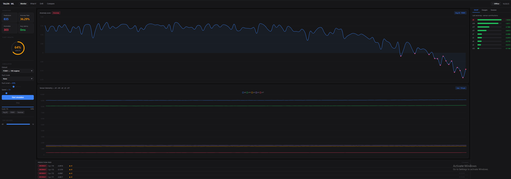

 
 
 
 
 ML Pipeline Deployment

A production-style REST API for serving a machine learning model, built around turbofan engine anomaly detection using real NASA sensor data. The goal was to go beyond just training a model — this project covers the full deployment lifecycle: serving predictions, explaining them, monitoring for data drift, simulating live sensor streams, and visualizing everything in a real-time dashboard.

---

## Overview

The core of the project is a trained Isolation Forest model that flags anomalous sensor readings from turbofan engines. Around that model I built:

- A FastAPI backend with endpoints for single prediction, batch inference, and SHAP-based explanations
- A drift detection system using KS-tests to catch when incoming data shifts away from the training distribution
- A WebSocket-based engine simulator that replays NASA C-MAPSS data in real time with configurable fault injection
- A SQLite audit log that records every prediction made
- A browser dashboard for live monitoring, what-if analysis, drift visualization, and side-by-side engine comparison

---

## The Dashboard

The dashboard is a single HTML file — no build step, no framework, just open it in a browser. It connects to the API over WebSocket and HTTP.

**Monitor tab** — live anomaly score chart, sensor telemetry, SHAP contributions panel, scrolling prediction feed

**What-If tab** — sliders for each of the 9 sensor inputs. Drag a value and watch the prediction and SHAP breakdown update instantly. Good for understanding where the model's decision boundary sits

**Drift tab** — run a KS-test on the last sensor reading and see which sensors are drifting away from the training distribution, with severity levels and a plain-English recommendation

**Compare tab** — stream two engines simultaneously on the same chart. Useful for seeing how different fault modes diverge over time

---

## Fault Injection

The simulator can inject one of four fault modes into the sensor stream:

- **Bearing wear** — progressive vibration and heat signatures in s4, s11, s14
- **Compressor stall** — airflow disruption affecting s2, s3, s17
- **Fuel system degradation** — delivery inefficiency in s7, s9, s12
- **Turbine erosion** — blade material loss showing up in s9, s11, s12, s14

Fault severity increases gradually over the engine's remaining cycles so the model sees realistic degradation rather than a sudden step change.

---

## API

```
GET  /health                    system status
GET  /model/info                model metadata and feature names
POST /predict                   single sample prediction
POST /predict/batch             batch inference up to 512 samples
POST /explain                   prediction + ranked SHAP contributions
POST /drift                     KS-test drift check
GET  /drift/baseline            training distribution reference
GET  /simulator/datasets        C-MAPSS dataset info
GET  /simulator/fault-modes     available fault modes
WS   /ws/simulate               live WebSocket simulation stream
GET  /dashboard/stats           aggregate stats
GET  /dashboard/recent          recent predictions
GET  /dashboard/timeline        hourly anomaly counts
GET  /dashboard/top-drivers     most frequent SHAP top drivers
```

Interactive docs at `http://localhost:8001/docs` once the server is running.

---

## Dataset

NASA C-MAPSS (Commercial Modular Aero-Propulsion System Simulation). Four sub-datasets with varying numbers of engines, fault modes, and operating conditions. The model was trained on FD001 — 20,631 cycles across 100 engines, using 9 sensor features.

---

## Getting Started

```bash
git clone https://github.com/cymmerman/ml-pipeline-deployment.git
cd ml-pipeline-deployment

python -m venv venv
venv\Scripts\activate
pip install -r requirements.txt

# Train the model
python train_model.py

# Start the API
python -m uvicorn Main:app --host 0.0.0.0 --port 8001

# Serve the dashboard (separate terminal)
python -m http.server 3000
```

Then open `http://localhost:3000/Dashboard.html` for the dashboard and `http://localhost:8001/docs` for the API.

---

## Docker

```bash
docker build -t ml-pipeline-deployment .
docker run -p 8001:8000 ml-pipeline-deployment
```

---

## Stack

- **FastAPI** — async REST API and WebSocket server
- **scikit-learn** — Isolation Forest model
- **SHAP** — TreeExplainer for per-prediction feature attribution
- **pandas / numpy / scipy** — data processing and KS-tests
- **aiosqlite** — async SQLite for prediction logging
- **Chart.js** — dashboard charts
- **Docker** — containerization

---

## Related Projects

- [`turbofan-predictive-maintenance`](https://github.com/cymmerman/turbofan-predictive-maintenance) — where the model in this repo was originally developed
- [`aerospace-nlp-document-classifier`](https://github.com/cymmerman/aerospace-nlp-document-classifier)
- [`mcmc-bayesian-flight-estimation`](https://github.com/cymmerman/mcmc-bayesian-flight-estimation)
